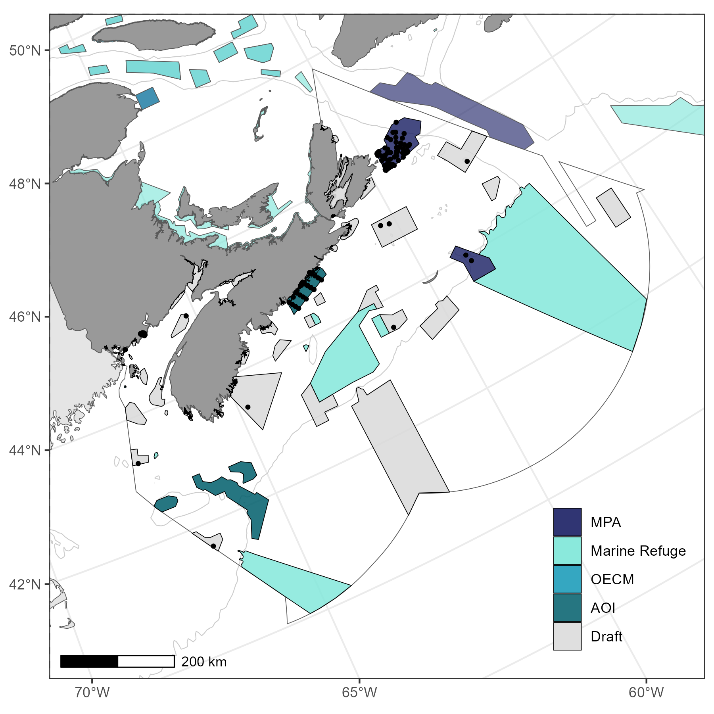

# Canadian_eDNA_MPA
Progress on Operationalizing eDNA Biomonitoring within Canadian Marine Conservation Areas

#Figure 1 - Canadian Conservation Network

#Scotian Shelf-Bay of Fundy conservaiton network eDNA sampling program